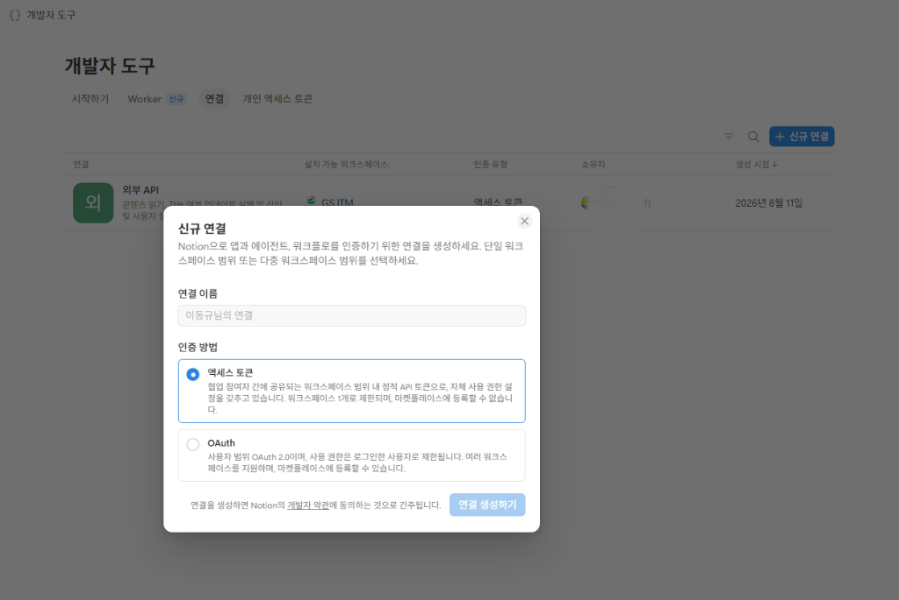
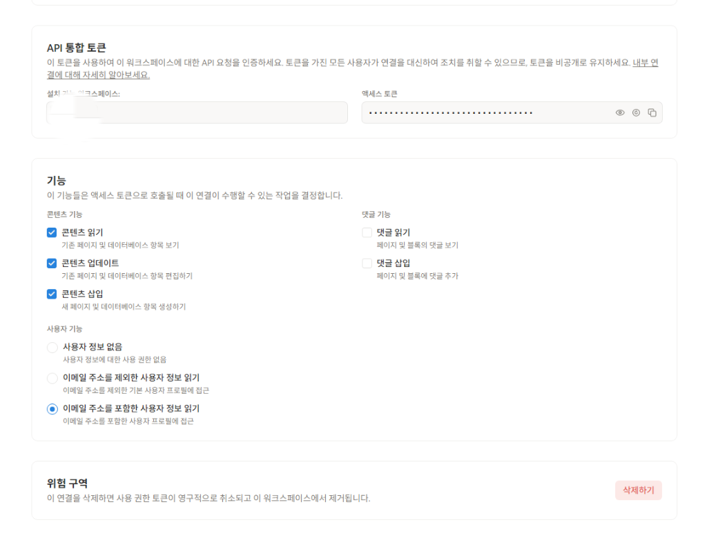
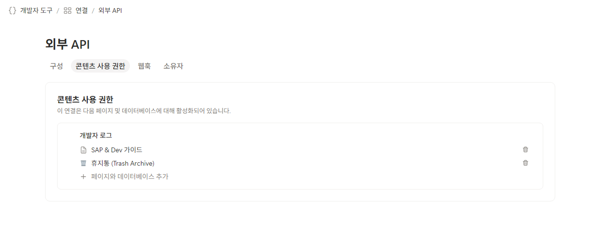
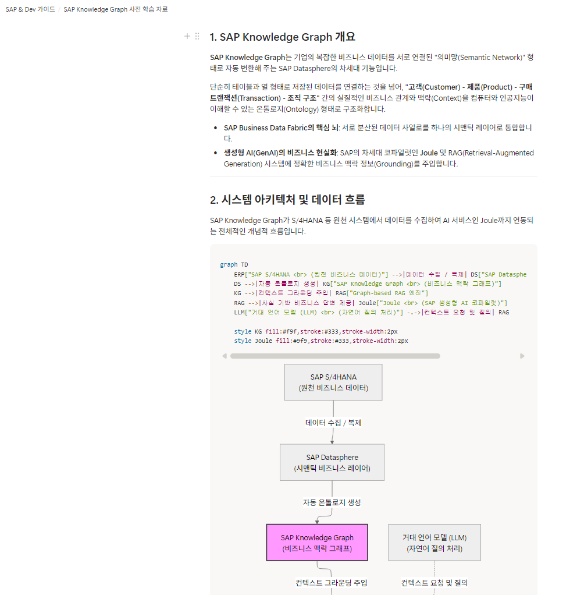

# 🚀 Notion AI Sync CLI

Claude Code 같은 셸 명령을 실행할 수 있는 AI 에이전트가, 사용자의 자연어 요청에 따라 Notion 문서를 읽고 쓰고 정리하도록 만든 CLI 도구입니다. 글 작성/요약/마스킹 같은 실제 "AI" 작업은 이 CLI가 아니라 호출하는 에이전트 자신이 하고, CLI는 그 결과를 Notion API에 반영만 하는 실행기입니다.

---

## 🌟 주요 기능

에이전트가 `notion-cli`를 통해 수행하는 6가지 작업입니다 (자세한 사용 흐름은 [`.agents/skills/notion-ai-tool/SKILL.md`](.agents/skills/notion-ai-tool/SKILL.md) 참고):

1. **원문 읽기 / 요약** — 페이지 내용을 마크다운으로 읽고, 에이전트가 직접 3줄 요약 + 키워드를 작성해 토글 블록으로 삽입.
2. **글쓰기 (신규 페이지)** — 에이전트가 작성한 마크다운(헤더, 불릿, 체크리스트, 코드블록, 표, 토글, 콜아웃 등)을 지정한 상위 페이지 밑에 새 페이지로 생성.
3. **안전한 글수정** — 원문은 그대로 두고 수정 제안 배너를 먼저 추가(`propose-edit`), 승인 시에만 원문을 휴지통에 백업하고 교체(`approve-edit`).
4. **삭제 및 휴지통 관리** — 삭제는 항상 보관(archive) + 휴지통 기록이며 `restore`로 되돌릴 수 있음.
5. **회사정보 마스킹** — 이메일/전화/IP/접속키워드/URL 등을 정규식으로 스캔(`scan`)하고, 이미지 속 텍스트는 OCR(`scan-images`)로 확인해 안전한 글수정 흐름으로 마스킹.
6. **API 연결 및 보안 가이드** — API 토큰은 `.env`의 `NOTION_API_KEY`로 관리하며, Notion 페이지 우측 상단 `•••` → `Add connections` → 통합 이름을 클릭해 페이지별로 권한을 연결합니다.

---

## 🔑 Notion API 키 발급 및 설정 가이드

Notion과 연동하여 동기화 기능을 수행하기 위해서는 Notion API 통합 토큰(API Key)이 필요합니다. 아래 순서에 따라 연결을 생성하고 키를 설정하세요.

### 1단계: 신규 연결 생성

1. [Notion Developers Connections](https://app.notion.com/developers/connections) 페이지에 접속합니다.
2. 우측 상단의 **`+ 신규 연결`** 버튼을 클릭합니다.
3. **연결 이름**(예: `이동규님의 연결` 등)을 입력하고, 인증 방법에서 **`액세스 토큰`**을 선택한 뒤 **`연결 생성하기`**를 클릭합니다.



### 2단계: API 통합 토큰 확인 및 권한 설정

1. 생성된 연결 설정 페이지에서 **`액세스 토큰(API 통합 토큰)`** 값을 복사하여 로컬 프로젝트 루트의 `.env` 파일 내 `NOTION_API_KEY` 값으로 추가합니다.
   ```properties
   NOTION_API_KEY=ntn_xxxx...
   ```
2. **기능(Capabilities)** 섹션에서 아래 권한들이 활성화되어 있는지 확인합니다:
   - **콘텐츠 읽기** (필수)
   - **콘텐츠 업데이트** (필수)
   - **콘텐츠 삽입** (필수)
   - **이메일 주소를 포함한 사용자 정보 읽기** (선택)



### 3단계: 페이지에 통합 연결하기 (콘텐츠 사용 권한)

통합(Integration)을 만들었다고 워크스페이스의 모든 페이지에 자동으로 접근되는 게 아닙니다. AI가 읽거나 쓸 페이지마다 이 통합을 개별로 연결해줘야 합니다.

1. 연결하려는 Notion 페이지를 열고 우측 상단 `•••` → `연결 추가(Add connections)` → 아까 만든 통합(예: `외부 API`)을 선택합니다.
2. 이미 연결된 페이지들은 [Notion Developers Connections](https://app.notion.com/developers/connections) → 해당 통합 → **콘텐츠 사용 권한** 탭에서 한눈에 확인하고 관리할 수 있습니다.



여기 없는 페이지는 API로 찾을 수 없습니다 (`object_not_found` 에러의 가장 흔한 원인입니다).

### 4단계: 휴지통(Trash Archive) 페이지 ID 설정 (필수)

"안전한 글수정"과 "삭제" 기능은 원문을 실수로 잃어버리지 않도록, 지우거나 덮어쓰기 전에 원본을 Notion 내의 별도 페이지에 백업해둡니다. 이 백업 위치로 쓸 페이지를 직접 만들고, 그 페이지의 ID를 알려줘야 합니다.

1. Notion에서 새 페이지를 하나 만들고(예: `휴지통 (Trash Archive)`), 아까 연결한 통합(Integration)에 이 페이지도 연결(`•••` → `연결 추가`)해줍니다.
2. 그 페이지를 열면 브라우저 주소창에 아래처럼 뜨는데, 맨 끝에 붙은 32자리 문자열이 페이지 ID입니다.
   ```
   https://app.notion.com/p/Trash-Archive-3b9813eb76778101a4c1d67d707c9506
                                           ^^^^^^^^^^^^^^^^^^^^^^^^^^^^^^^^
                                           이 부분이 페이지 ID
   ```
3. 이 값을 `.env`의 `NOTION_TRASH_PAGE_ID`에 넣습니다 (대시 `-` 유무는 상관없습니다).
   ```properties
   NOTION_TRASH_PAGE_ID=3b9813eb-7677-8101-a4c1-d67d707c9506
   ```

**이 설정은 필수입니다.** 설정하지 않으면 `approve-edit`(안전한 글수정 승인), `delete`, `list-trash` 명령이 Notion API를 아예 호출하지 않고 바로 에러를 내고 종료합니다 — 백업 없이 원문이 지워지는 일을 막기 위한 안전장치입니다.

**중요: "삭제"는 진짜 삭제가 아닙니다.** `notion-cli delete`는 Notion 페이지를 완전히 지우지 않습니다. Notion 공개 API에는 영구 삭제 기능 자체가 없어서, 내부적으로 `pages.update({ archived: true })`만 호출해 페이지를 보관(archive) 처리하고, 위에서 설정한 휴지통 페이지 밑에 원본을 가리키는 기록을 남깁니다. 즉 항상 복구 가능한 소프트 삭제이며, `notion-cli restore`로 되돌릴 수 있습니다.

---

## 🛠️ 설치

```bash
git clone <repo>
cd notion-sync
npm install
cp .env.example .env   # NOTION_API_KEY, NOTION_TRASH_PAGE_ID 채우기
```

CLI는 Node에서 Notion SDK(`@notionhq/client`)를 직접 호출하는 단순 스크립트라 별도 서버 실행이 필요 없습니다. `npm run notion <command>`로 바로 쓰거나, `npm link` 후 어느 디렉토리에서든 `notion-cli <command>`로 쓸 수 있습니다.

---

## 💬 사용 예시

진짜 사용법은 웹 화면 클릭이 아니라, Claude Code 같은 에이전트에게 말로 시키는 겁니다. 에이전트가 `notion-cli`를 대신 실행합니다.

```
"회의록" 페이지 밑에 오늘 회의 내용 요약해서 새 페이지로 만들어줘

"주간 보고서" 페이지 정리해줘. 핵심 요약이랑 액션 아이템만 뽑아서 추가해줘

노션 휴지통에 뭐 들어있어?

SAP Knowledge Graph 사전 학습 자료 생성해줘.
```

아래는 마지막 프롬프트로 실제 생성된 결과 페이지입니다.



---

## ⚠️ API로 되는 것 / 안 되는 것

이 도구는 Notion 공개 API 위에서 동작해서, API 자체의 한계를 그대로 물려받습니다.

### 확실히 되는 것

- 새 페이지/DB 항목 생성: 헤더, 불릿, 번호목록, 체크박스, 코드블록(mermaid 포함), 표, 토글, 구분선, 콜아웃까지 지원
- 기존 페이지에 내용 추가(append). 100블록 넘는 긴 글도 자동으로 나눠서 처리
- 페이지 전체 읽기, 검색, DB 항목 조회, 페이지 속성(제목/날짜/텍스트 등) 수정
- 삭제 = 보관(archive) 처리 + 복구(restore). 항상 되돌릴 수 있음
- 안전한 글수정: 수정 제안(propose-edit) → 승인 시 원문 자동 백업 후 교체(approve-edit)

### 절대 안 되는 것

- 블록 순서 변경, 페이지를 다른 위치로 옮기기 — Notion API에 이 기능 자체가 없습니다
- 완전 영구삭제 — API 설계상 보관(archive)만 가능합니다
- 다른 통합에 페이지 공유 권한 부여 — Notion 화면에서 수동으로만 가능합니다

### 주의사항: "정리" 요청 시 반드시 안전한 흐름을 거치세요

과거에 `approve-edit`가 원문을 휴지통에 백업할 때 목록 조회를 한 번만 하고 다음 페이지를 안 가져오는 버그가 있었습니다. 그래서 **100블록이 넘는 긴 글을 정리하다가, 백업이 일부만 된 채로 원문이 지워진 사례**가 있었습니다. 지금은 고쳐서 실제 회의록으로 재검증까지 마쳤지만([관련 수정](https://github.com/dongqdev/notion-sync/commit/8e97deb)), 아래 습관은 계속 지키는 걸 권장합니다.

- 원문을 직접 지우고 새로 쓰게 시키지 마세요. 항상 propose-edit → approve-edit 흐름을 거치면, 원문이 백업된 뒤에만 교체됩니다.
- approve-edit/delete 실행 후 나오는 결과 메시지의 "Trash Page" 링크를 열어, 실제로 백업이 들어갔는지 한 번은 확인하는 습관을 들이세요.
- 마크다운 변환은 위 "확실히 되는 것" 목록까지만 지원합니다. 링크 `[텍스트](url)`, 이미지 마크다운, 4단계 이상 헤더, 중첩 목록, 취소선은 아직 지원하지 않아 글자 그대로 보일 수 있습니다.

---

## 📁 프로젝트 구조

- `cli/notion-cli.js`: 에이전트가 실행하는 CLI 본체 (search/get-content/create/append/propose-edit/approve-edit/delete/restore/scan 등)
- `lib/markdown-to-blocks.js`: 마크다운 → Notion 블록 변환 로직
- `.agents/skills/notion-ai-tool/SKILL.md`: 에이전트용 사용 가이드 (Claude Code 등이 프로젝트 스코프에서 읽음)
- `scripts/link-skills.mjs`: `.agents/skills`를 `.claude/skills`, `.codex/skills`로 심볼릭 링크
- `docs/index.html`: GitHub Pages 소개 페이지
