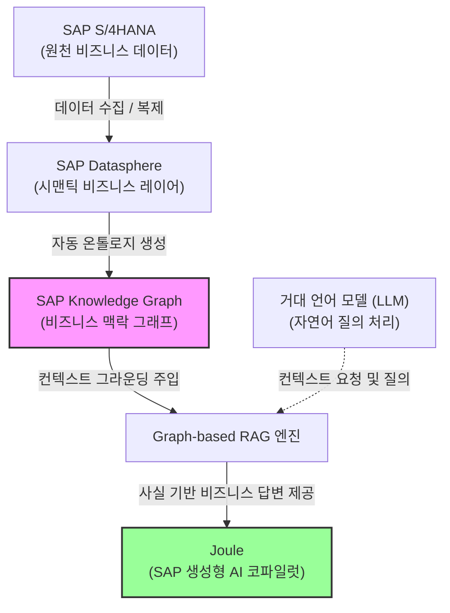

# SAP Knowledge Graph 사전 학습 자료

이 자료는 금요일 예정인 **SAP Knowledge Graph (지식 그래프)** 교육에 앞서, 핵심 기술 개념, 아키텍처, 비즈니스 가치 및 응용 시나리오를 빠르게 파악하기 위해 작성된 사전 학습 가이드라인입니다.

---

## 1. SAP Knowledge Graph 개요

**SAP Knowledge Graph**는 기업의 복잡한 비즈니스 데이터를 서로 연결된 "의미망(Semantic Network)" 형태로 자동 변환해 주는 SAP Datasphere의 차세대 기능입니다. 

단순히 테이블과 열 형태로 저장된 데이터를 연결하는 것을 넘어, **"고객(Customer) - 제품(Product) - 구매 트랜잭션(Transaction) - 조직 구조"** 간의 실질적인 비즈니스 관계와 맥락(Context)을 컴퓨터와 인공지능이 이해할 수 있는 온톨로지(Ontology) 형태로 구조화합니다.

* **SAP Business Data Fabric의 핵심 뇌**: 서로 분산된 데이터 사일로를 하나의 시맨틱 레이어로 통합합니다.
* **생성형 AI(GenAI)의 비즈니스 현실화**: SAP의 차세대 코파일럿인 **Joule** 및 RAG(Retrieval-Augmented Generation) 시스템에 정확한 비즈니스 맥락 정보(Grounding)를 주입합니다.

---

## 2. 시스템 아키텍처 및 데이터 흐름

SAP Knowledge Graph가 S/4HANA 등 원천 시스템에서 데이터를 수집하여 AI 서비스인 Joule까지 연동되는 전체적인 개념적 흐름입니다.

### 작동 프로세스
1. **자동화된 온톨로지 빌드**: Datasphere에 데이터가 유입되고 정의될 때, 시스템이 데이터 메타데이터를 분석하여 비즈니스 엔티티 간의 관계를 자동으로 학습하고 기본 온톨로지를 구성합니다.
2. **커스터마이징**: 자동 생성된 온톨로지는 내장 온톨로지 에디터(Ontology Editor)를 통해 기업의 고유한 속성과 요구 사항에 맞춰 커스텀 확장할 수 있습니다.
3. **Graph-based RAG 적용**: 사용자가 Joule 또는 연동된 AI에 자연어로 질문을 하면, 시스템은 관계 그래프(Knowledge Graph)를 탐색하여 정확한 사실(Fact)들만을 추려내어 LLM에 주입함으로써 오답(환각 현상)을 원천 차단합니다.

---

## 3. 핵심 기술 비교: Datasphere KG vs HANA Cloud Graph

SAP 에코시스템 내에는 그래프 기능을 수행하는 두 가지 핵심 엔진이 존재합니다. 교육 전 이 둘의 명확한 개념 차이를 인지하는 것이 중요합니다.

| 비교 항목 | **SAP Datasphere Knowledge Graph** (지식 그래프) | **SAP HANA Cloud Graph Engine** (기본 그래프) |
| :--- | :--- | :--- |
| **주요 목적** | AI 에이전트/LLM을 위한 시맨틱 맥락 이해 및 비즈니스 데이터 의미 연결 | 복잡한 그래프 알고리즘 계산 및 개발자 커스텀 분석 처리 |
| **핵심 성격** | 메타데이터 기반 자동 생성, 비즈니스 중심 온톨로지 | 기술적이고 물리적인 개발자 중심의 고성능 그래프 데이터베이스 |
| **주요 기능** | Joule 연동, Graph-based RAG 구동, 자연어 비즈니스 질의 | 최단 경로 분석, 소셜 네트워크 분석, 패턴 매칭 등 특화 알고리즘 구동 |
| **역할 정의** | AI 서비스와 비즈니스 데이터 패브릭의 연결자 (Brain) | 고난도 데이터 연산 처리기 (Engine) |

---

## 4. 왜 SAP Knowledge Graph가 중요한가? (비즈니스 가치)

### 1) AI 환각 현상(Hallucination) 방지
일반적인 RAG 시스템은 텍스트의 유사성(Vector Similarity)에만 의존하여 관련 문서를 LLM에 던져줍니다. 반면 **Graph-based RAG**는 "A 고객이 B 제품을 구매했고, 해당 영업소는 C 지역에 있다"와 같은 명확한 사실 관계 체인(Facts Chain)을 LLM에 주입하므로 대답의 정확도가 비약적으로 향상됩니다.

### 2) 기술적 복잡성의 은닉
전통적인 ERP 분석을 위해서는 복잡한 CDS View나 수십 개의 테이블 조인(Join) 구조를 쿼리로 짜야 했습니다. Knowledge Graph 기반에서는 Joule을 통해 "지난달 A 거래처와 거래한 내역 중 특이사항이 포함된 보고서를 요약해줘"와 같이 비 개발자도 자연어로 즉시 정보를 호출할 수 있습니다.

---

## 5. 교육 참석 전 자가 점검 질문 (사전 준비)
금요일 교육 과정에서 다루게 될 주요 질문들입니다. 미리 고민해 보시면 교육 효과를 극대화할 수 있습니다.

* **Q1.** 우리 회사의 기존 ERP 데이터 모델 중, 테이블 조인 방식이 아닌 '그래프 관계망'으로 표현했을 때 큰 시너지를 낼 수 있는 비즈니스 영역(예: 복잡한 부품 BOM 구조, 글로벌 공급망 공급처 관계, 고객 여정 단계 등)은 어디인가?
* **Q2.** 현업 부서에서 IT 개발자 도움 없이 자연어(챗봇 형태)로 질의하여 즉시 인사이트를 얻고자 하는 핵심 비즈니스 시나리오는 무엇인가?
* **Q3.** Datasphere에서 구성한 시맨틱 뷰(Semantic View)들이 어떻게 Knowledge Graph의 온톨로지 정보로 변환되어 Joule에 수용되는가?
